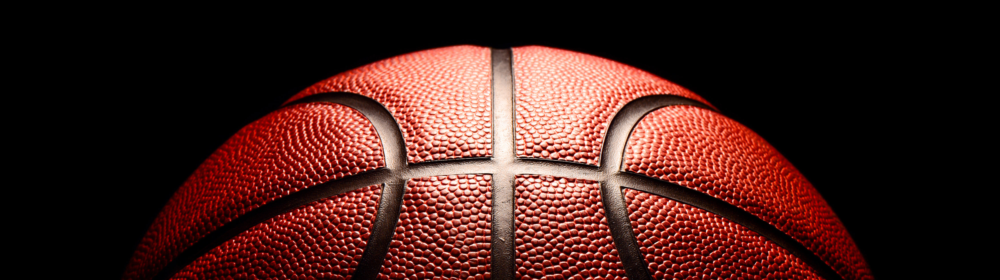

# Basketball Broadcaster

# Inspiring project

We are just continuing our previous [Automated Basketball Broadcasting](https://github.com/jnebrera/Amateur_Basketball_Broadcasting) project incorporating the ideas extracted from the blog post [Automatically measuring soccer ball possession with AI and video analytics](https://tryolabs.com/blog/2022/10/17/measuring-soccer-ball-possession-ai-video-analytics) by [Tryolabs](https://tryolabs.com).

# Project restart

You can see the design and consideration in the original [about section](https://github.com/jnebrera/Amateur_Basketball_Broadcasting/blob/main/about.md).

The project is returning to life due to two facts:

1. I have found an ultra panoramic camera at a very reasonable price, affordable enough for parents and amateur basketball clubs
2. The availability of free hosted notebook environments with access to a preconfigured GPU enables users to have access to a powerful GPU to process the video with ease

The combination of the two makes it viable again to restart this project and be accessible to amateur basketball enthusiasts like me.

# First goals

The main difficulty we found in the previous iteration of the project was people and ball detection. Now we can try using ML techniques to do so, and especially, reduce false positives of people appearing in the camera but not in the field that caused quite a bit of issues in the past (coachs and players on the bench mainly).

Our first goal is to be able to detect players with a COCO pre trained YOLOv8 model (improving the YOLO v5 in the blog post) and it works quite well. As suggested by the authors, even upgrading YOLO to v8 is still not enough to detect the ball, so we are now training a custom model for player and basketball detection with a private dataset of around 4K labeled images.

 

Also, the way we are processing the video loses the audio, which is key for a good experience, so we are changing that with PyAV to maintain the original audio track.

After that, we will add multi class Multi Object Tracking (MOT) based on Norfair to see if we can reduce the load on the system by limiting the number of frames we have to run detection while still maintaining an idea of the position of players and ball. 

It is important to understand that for our usage scenario (generating a broadcast-quality type video) we don't need this tracking to be very precise. Things like ReIdentification or MOT fine-tuning are not needed. Actually, in our original project, we just skipped a bunch of frames after each detection and the results were still fine.

Finally, we will remove a lot of the cloned code as it is not needed in our project (pass detection, team detection, player in possession detection, possession calculation, possession display) to leave the code as clean as possible.

# And later?

Of course, this is an ongoing project with things to do:

1. Small Object Detection using [SAHI: Slicing Aided Hyper Inference](https://github.com/obss/sahi) to improve the detection of the ball if the custom model results are not good enough or if the original image is too big
2. Discard people with feet outside the playing field (nonplayers) with a combination of lower bounding box position and pose estimation.
3. Implement 1 degree of freedom movement (panning)
4. Smooth the movement using [1€ filter](https://jaantollander.com/post/noise-filtering-using-one-euro-filter/)

Once we reach this point, it should be easy to make the app work in Google Colab or similar (actually we are using it for validation), enabling parents and clubs to record their games in ultra panoramic format and later process them into a 16:9 broadcast ratio while keeping the camera in the action. All this code will be available under AGPL license.

# Further improvements

If I get some funding or help, there is still work that can be done:

1. Use RTMDet for detection
2. Use RTMPose for pose estimation
3. Change Norfair MOT to OCSort or similar
4. Improve the custom model with an extended 16K images dataset
5. Implement 3 degrees of freedom movement (Pan / Tilt / Zoom)
6. Directly capture video from RTSP stream (security cameras)
7. Directly produce video to RTMP stream (Youtube, ...)

This code will no longer be available under AGPL but some kind of proprietary license, unless I get proper funding to cover all the effort.
